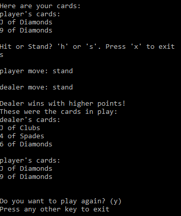

# Blackjack Implementation 
With an interest in blackjack, I created a simple blackjack game to explore the basic logic
of the game as well as practice object-oriented programming and application development fundamentals.

Applications Used: Ruby

## Getting started

### Instructions:
* Download zip to local machine
* Use Ruby [Windows Installer](http://rubyinstaller.org/downloads/)
* For other operating systems visit [here](https://www.ruby-lang.org/en/downloads/) to run program
* Associate .rb files with ruby interpreter during installation
* For Windows machines, double click "Blackjack.bat" in main directory to run the game ("Run All Tests.bat" in the Testing Folder)

## Rules
There will be 2 players: a human player (user) and a dealer (script)

* The players are each dealt 2 cards to start the hand
* The player can choose to hit or stand with any amount
* The dealer must hit if his cards total less than 17 and stand otherwise
* If the player’s or dealers cards total over 21, they bust and their turn is over
* If either player has 21 with their first two cards, they win (unless they both have 21 on their first two cards, in which case it is a tie)
* If both players bust, the dealer wins
* If both players have the same score, they tie
* The player always takes their turn before the dealer
* All cards count as their face value, except an Ace which can be 1 or 11 and J, Q, K all count as 10
* Deck is shuffled before each game
* No advanced blackjack rules (split, double)

## Gameplay
